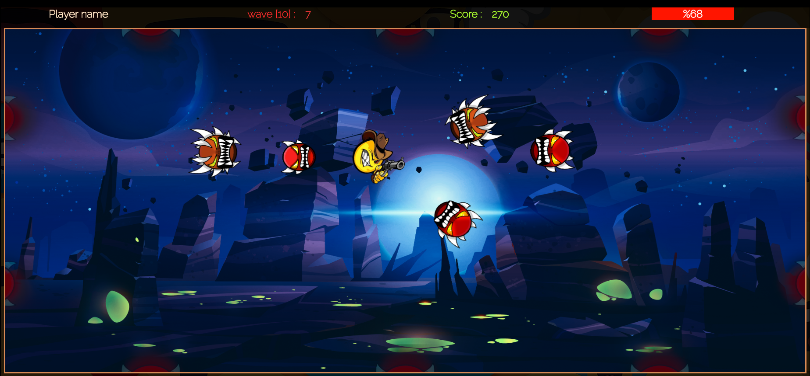

# Emoji War game

            

 
Once upon a time, there was a devil soul who tried to spread frustration and sadness between mankind, when humans realized the danger they sent 3 of their most prim worriers to fight for them, the worriers were so proud to be chosen for this holy mission, they geared up with their favorite weapons and started the journey to devil soul nests, there were 3 nests they need to take them down, so they greeted each other and got separated, one worrier for one nest, but they need help from you as a player to guide them in this fight.

## Team Members
            
* Aalaa Mohamed Habib
* Ibrahim Muhammad Abd-el-Kader
* May Esmail Muhammad
* Mohamed Ahmed AbdelRaouf
            
### Help Our Worriers from <a href="https://fervent-fermi-89025a.netlify.app/">here</a>

## Game Screens

### Registeration
* To enter the game you must be registered first to save your information and achievements e.g. (Last Level, Last Character, Badges & Awards, etc). 
Saving information will be in the same browser using local storage, "make the devil feel the danger".

### Login
* As soon as you logged in, you will be ready to gear up and choose your worrier, and explore the Emoji War

### Home Page
* Now in the Home page arena it's time to know about the war e.g. (your acheivements,  more info about the War), after that just click play to gear up and start the War.

### Select Character.
* At first you have to prove your skills, so you will start the war with the first Worrier and after you win your first mission you will be able to choose a more powerful worrier

### Select level's map
* Now it's time to enter the war, you have to win your first war to prove your skill to enter more intense war with more evil and power full enemies, so you can choose any unlocked character and choose any of the unlocked War level you want to play, when you're done click Enter the War to play.

## Victory Page.
* When you win any of the war missions you will get the mission badge and a Victory celebration message shows up.

## Badges Page.
* If you're a logged-in Worrier you can see your achivements and the badges you've won, you will win the first badge after register.
but if you are not logged-in you can only see information about every badge and when you can get it.

## Defeat Page.
* Defeat consolation message shows up when the worrier lose the game, maybe its time to train harder.

# Game Sound Effects.
* There are a various sound tracks and effects in the game for : 
1- Home Page 
2- Each Level  
4- Win Message 
5- Lose Message 
6- Player Fire Sound Effect for every Character 
7- Player Hit Sound Effect for every Character 
8- Enemy Hit Sound Effect 
9- Enemy Dead Sound Effect 

Remember Player Fighter : "This is a war to end all wars, so do your best"

# Project files tree.

