# Emoji War game

<p align="center">


</p>

## Team Members

## Aalaa Mohamed Habib
## Ibrahim Muhammad Abd-el-Kader
## May Esmail Muhammad
## Mohamed Ahmed AbdelRaouf
            
#

# Play our game here:

https://fervent-fermi-89025a.netlify.app/

#

# Pages

## Registeration Page.
To enter the game you must be registered first to save your information and achievements such as (Last Level, Last Character, Badges & Awards, etc). 
Saving information will be in the same browser using local storage.

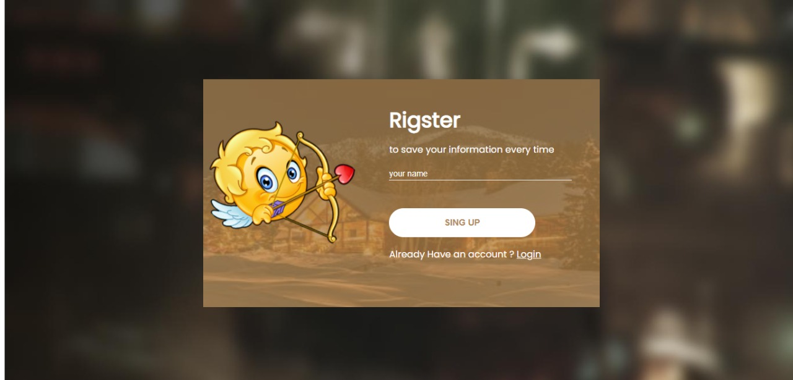

#

## Login Page.
By this page we can select the character and the level of the game and start the game.


#

## Home Page.
The first page to be displayed to user in which you can navigate to all other pages (Like seeing your bages or see information about us, etc ... or go to the game). 

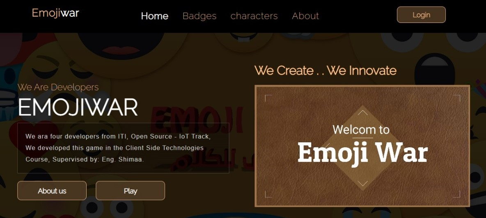

#

## Play page.
In this page we allow you to enter a Nickname other than your login name and you can change it overtime, also you can choose any unlocked character and choose the map of the level you want to play, when you're done clik Enter the War to play.

### Select Character.
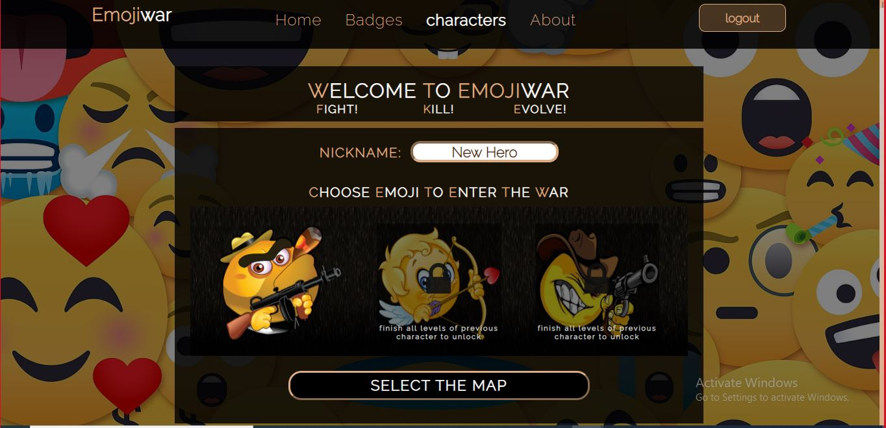
<br>

### Select level's map
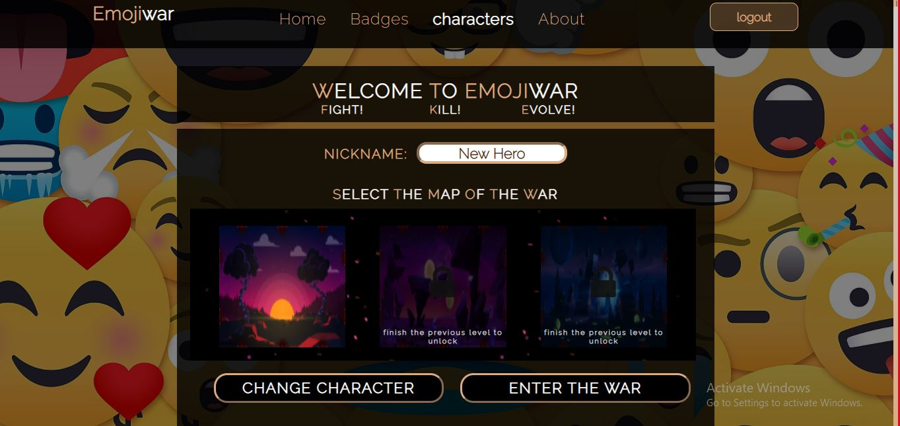

#

## Badges Page.
If you're a member logged-in member you can see your achivements and the badges you've won ,and you will win the first badge after register.
but if you are not logged-in you can only see information about every badge and when you can get it.


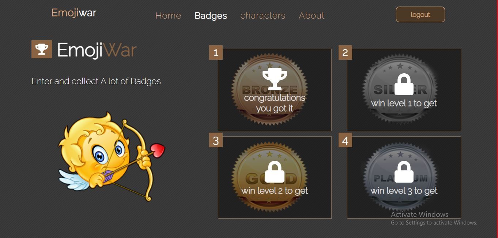

#

## Victory Page.
Victory celebration message shows up when the player win a level with its badge to be added to the player badges.

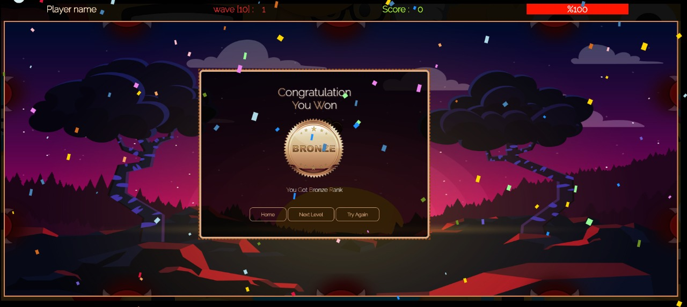

#

## Defeat Page.
Defeat consolation message shows up when the player lose the game.
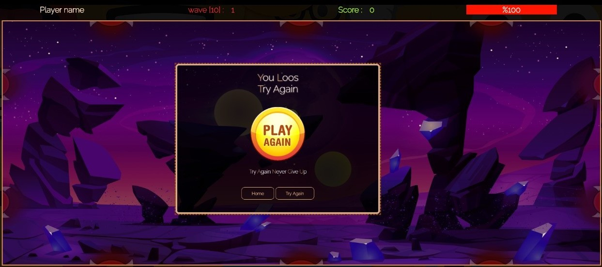

#

# Game Sound Effects.
  there is a various sound tracks and effects in the game for :<br/>
1- Home Page<br/>
2- Each Level <br/>
4- Win Message<br/>
5- Lose Message<br/>
6- Player Fire Sound Effect for every Character<br/>
7- Player Hit Sound Effect for every Character<br/>
8- Enemy Hit Sound Effect<br/>
9- Enemy Dead Sound Effect<br/>

#

# Game Description
<b>EmojiWar</b> : Once upon the time there was a devil soul who tried to spread frustration and sadness between the man kind, when humans realized the danger they sent 3 of their most prim worrier to fight for them, the worriers was so proud to be chosen for this holly mission, they geared up with their favorite weapons and started the journey to devil soul nests, there was 3 nests they need to take them down, so they greeted each other and got separated, one worrier for one nest, but they need help from you as a player to guide them in this fight.  

Remember Player Fighter : "This is a war to end all wars, so do your best"

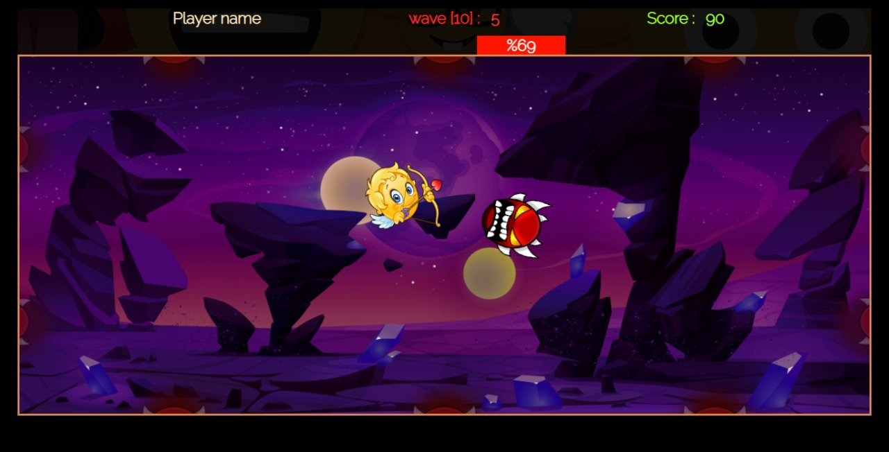

# Project files tree.
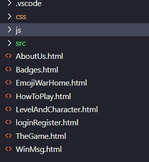

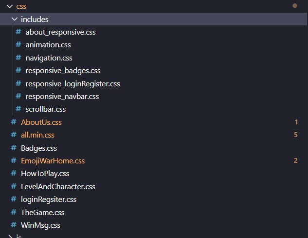

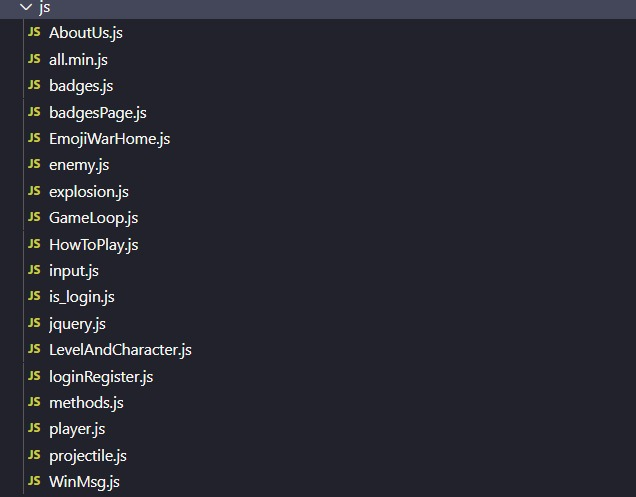

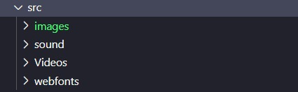

#

# Samples of codes.

## Sample HTML file

login and register page
```
<!DOCTYPE html>
<head>
    <link rel="preconnect" href="https://fonts.gstatic.com">
<link href="https://fonts.googleapis.com/css2?family=Poppins&display=swap" rel="stylesheet">
    <link rel="stylesheet" type="" href="css/loginRegsiter.css">
</head>
<body>
    <section class="loginRegister">
        <div class="container">
            <div class="overlay">
                <div class="character">
                    
                </div>
                <div class="swap">
                    <div id="register" class="hidden">
                        <h2>Rigster</h2>
                        <p>to save your information every time</p>
                        <form action="">
                            <div class="form-group">
                                <input type="text" name="name" id="register-name" placeholder="your name" class="form-input">
                            </div>
                            <div class="form-group">
                                <label for="agree" id="error_register" style="color:brown;font-weight: bold; font-size: 20px;"></label>
                            </div>
                            <div class="form-group">
                                <input type="submit" id="register-btn" name="submit" value="Sing up"class="btn active">
                            </div>
                            <p>Already Have an account ? <span class="login-nav" id="login-nav">Login</span></p> 
                        </form>
                    </div>
                    <div id="login" class="visible">
                        <h2>Login</h2>
                        <p>we miss you,Welecome back again </p>
                        <form action="">
                            <div class="form-group">
                                <input type="text" name="name" id="userName" placeholder="your name" class="form-input">
                            </div>
                            <div class="form-group">
                                <label for="agree" id="error_login" style="color:brown;font-weight: bold; font-size: 20px;"></label>
                            </div>
                            <div class="form-group">
                                <input type="button" name="login" id=login-btn value="sing in" class="btn active">
                            </div>
                            <p>Don't have an account? <span class="login-nav" id="register-nav">register</span></p> 
                        </form>
                    </div>
                </div>
            </div>
        </div>

    </section>
    <script src="js/loginRegister.js"></script>
</body>
</html>
```


## Sample CSS file.

navigation bar:
```
/************************** navbar *****************/
nav {
    overflow: hidden;
    padding: 20px 10px  ;
    
    /* bounce effect */
    -webkit-animation: bounce 1s ease-out;
    -moz-animation: bounce 800ms ease-out;
    -o-animation: bounce 800ms ease-out;
    animation: bounce 1s ease-out;
  }
  .container{
    font-size: x-large;
    animation:  1s ease-out;
  
  }
  nav .container{
    width: 80%;
    margin: auto;
  }
  nav .nav-logo, 
  nav .nav-items{
    display: inline-block;
    float: left;
  }
  nav .nav-logo{ 
    width:25%;
    cursor: pointer;
  }
  
  /* Nav Bar Logo Effect*/
  nav .nav-logo p:hover{
    font-weight: bolder;
    font-size:xx-large;
    transition: font-size 0.2s;    
  }
  nav .nav-logo p:active{
  font-weight: bolder;
  color:rgb(251, 230, 170);   
  }
  /**********************/
  
  nav .nav-logo p{
    color:#dbab83;
    letter-spacing:.9px;
    font-size: 28px;
    font-weight: 800;
  }
  nav .nav-items{width: 60%;}
  nav ul li {
    list-style: none;
    display: inline-block;
    padding: 10px 15px;
  }  
  nav ul a {
    color:#dbab83;
    letter-spacing: 1px;
    text-decoration: none;
  }
  
  nav ul .active a{
    color: #fff;
    font-weight: bold;
  }
  nav ul .deactive a{
  color:#dbab83;
  letter-spacing: 1px;
  text-decoration: none;
  }
  
  /* Nav Bar Menu items Effect*/
  nav ul  a:hover{
    font-weight: bolder;
    font-size:larger;
    transition: font-size 0.2s;
  }
  nav ul  a:active{
    font-weight: bolder;
    color:rgb(251, 230, 170);
  }
  /****************************/
  
  nav .nav-login{display: inline-block; float:right;}
  nav .nav-login button{
      cursor: pointer;
      background-color: transparent;
      border:1px solid#dbab83;
      padding: 10px 40px;
      border-radius: 10px;
      color:#dbab83;
      font-weight: bold;
      font-size:large ;
      background-color:rgba(77,56,36,.9);
      outline:none;
  }
  /* Nav Bar Logoin Button Effect*/
  nav .nav-login button:hover{
      background-color: #8a6343;
      color: #fff;
      font-size: x-large;
      transition: font-size 0.2s;
  }
  nav .nav-login button:active{
      background-color: rgba(129, 89, 48, 0.9);
      border:1px solid#4d3824e6;
  }
/**********************Responsive Navbar********************************/
.hidden{ display: none;}
.visible{display: block;}
  @media(max-width:1150px){
    .nav-items,.nav-login{
      display: none !important;
    } 
    .nav-logo{width:20%;float:left}
    .responsive-nav {
      width: 80%;
      float: left;
    }
    .responsive-nav li{
      width: 100%;
      float: left;

    }
    .responsive-nav a:hover{
      color: #ddd;
    }
  }
  @media(min-width:1151px){
    .responsive-nav{
      display: none;
    }
  }
  ```
#
## Sample JavaScript Code

Player's File Code : 
```
  
//import directions from input to check the move direction
import { directions } from '/js/input.js'
import { hitDetected } from '/js/methods.js'
import Enemy from '/js/enemy.js';
import { getRandomInt, resetIfOutOfScreen, updateLayout } from '/js/methods.js'
export var playerCharacters = [
    {
        size: 120,
        speed: 50,
        character: document.getElementById("character1"),
        shootingSound: document.getElementById("shoot1"),
        hurtSound: document.getElementById("maleHurt"),
        health: 50,
        projectileInfo: {
            size: 20,
            speed: 120,
            character: document.getElementById("projectile1")
        },
    },
    {
        size: 120,
        speed: 70,
        character: document.getElementById("character2"),
        shootingSound: document.getElementById("shoot1"),
        hurtSound: document.getElementById("femaleHurt"),
        health: 80,
        projectileInfo: {
            size: 30,
            speed: 140,
            character: document.getElementById("projectile2")
        }
    },
    {
        size: 120,

        speed: 80,
        character: document.getElementById("character3"),
        shootingSound: document.getElementById("shoot1"),
        hurtSound: document.getElementById("maleHurt"),
        health: 120,
        projectileInfo: {
            size: 30,
            speed: 200,
            character: document.getElementById("projectile3")
        }
    }
]

//player class
export default class Player {
    constructor(playerIndex, gameScreen) {
        this.characterInfo = playerCharacters[playerIndex];
        this.winFlag = -1;
        this.size = this.characterInfo.size;
        this.speed = this.characterInfo.speed;
        this.position = {
            x: gameScreen.width / 2 - this.size / 2,
            y: gameScreen.height / 2 - this.size / 2
        };
        this.gameWidth = gameScreen.width;
        this.gameHeight = gameScreen.height;
        this.character = this.characterInfo.character;
        this.shootingSound = this.characterInfo.shootingSound;
        this.rotation;
        this.scale = 1;
        this.health = this.characterInfo.health;
        this.projectileIndex = this.characterInfo.projectileIndex;
        this.layout = {
            left: this.position.x - this.size / 2,
            right: this.position.x + this.size / 2,
            top: this.position.y - this.size / 2,
            bottom: this.position.y + this.size / 2
        }
        this.hurtSound = this.characterInfo.hurtSound
        this.wave = 1;
    }
    shoot(isShooting) {
        if (isShooting) {
            //shoot effect
            this.shootingSound.play();
            this.scale = 1.08;
        }
        //generation of projectile should be here
        //VVVVVVVVVVVVVVVVVVVVVVVVVVVVVVVVVVVVVVV
    }
    //draw method that will be executed in the game loop after move() method to update the position
    draw(context, mousePosition) {
        let scaleX = 1;
        if (this.position.x > mousePosition.x) {
            //getting the angle to the mouse position
            this.rotation = Math.atan2(mousePosition.x - this.position.x, -(mousePosition.y - this.position.y)) + 1.4;
            //mirorr the character horizontally when it's flipped 
            scaleX = -1;
        }
        else {
            this.rotation = Math.atan2(mousePosition.x - this.position.x, -(mousePosition.y - this.position.y)) - 1.32;
        }
        //save other context objects to not be affected by the rotation
        context.save();
        //draw the over context in the x,y position
        context.translate(this.position.x, this.position.y)
        //rotate the draw by the calculated angle
        context.rotate(this.rotation);
        //scale effect on the contect before draw the image
        context.scale(scaleX * this.scale, this.scale);
        //draw the image over the drawn area to be rotated by the same value
        context.drawImage(this.character, -this.character.style.width - this.size / 2, -this.character.style.height - this.size / 2, this.size, this.size)
        //restore the other context objects
        context.restore()
    }
    isHit(enemies) {
        for (let i = 0; i < enemies.length; i++) {
            //enemy touches the player
            if (hitDetected(enemies[i], this)) {
                if (this.isPlayerDead(enemies[i].health)) { // decrease player health check if dead
                    //Lost Msg & set the winFlag to Pause the Game
                    this.winFlag = 0; //you've lost
                }
                else {
                    this.hurtSound.play();
                    enemies.splice(i, 1);
                    if (enemies.length == 0) {
                        this.wave++;
                        if (this.wave > 10) {
                            //Win Msg & set the winFlag to Pause the Game
                            this.winFlag = 1;   
                        }
                        else {
                            $("#waveNo").html(this.wave);
                            for (let i = 0; i < this.wave; i++) {
                                enemies.push(new Enemy(getRandomInt(0, 3), gameScreen))
                            }
                        }
                    }
                }
            }
        }
    }

    //move method that will be executed in the game loop before the draw() method
    move(held_directions, deltaTime) {
        if (!deltaTime) return;
        let heldDirections = [held_directions[0], held_directions[1]];
        //up_right
        if (heldDirections.includes(directions.up) && heldDirections.includes(directions.right)) {
            this.position.y -= this.speed / deltaTime;
            this.position.x += this.speed / deltaTime;
        }
        //up_left
        else if (heldDirections.includes(directions.up) && heldDirections.includes(directions.left)) {
            this.position.y -= this.speed / deltaTime;
            this.position.x -= this.speed / deltaTime;
        }
        //down_right
        else if (heldDirections.includes(directions.down) && heldDirections.includes(directions.right)) {
            this.position.y += this.speed / deltaTime;
            this.position.x += this.speed / deltaTime;
        }
        //down_left
        else if (heldDirections.includes(directions.down) && heldDirections.includes(directions.left)) {
            this.position.y += this.speed / deltaTime;
            this.position.x -= this.speed / deltaTime;
        }
        //up_down_left_right
        else {
            if (heldDirections[0] === directions.right) { this.position.x += this.speed / deltaTime; }
            if (heldDirections[0] === directions.left) { this.position.x -= this.speed / deltaTime; }
            if (heldDirections[0] === directions.down) { this.position.y += this.speed / deltaTime; }
            if (heldDirections[0] === directions.up) { this.position.y -= this.speed / deltaTime; }
        }
        //set the illusion of a wall for a translated canvas img
        resetIfOutOfScreen(this)
        //update player character layout
        updateLayout(this)

    }
    isPlayerDead(value) {

        this.health -= value;
        let percentage = Math.round((this.health / this.characterInfo.health) * 100);
        if (percentage > 0) {
            $("#health").html("%" + percentage).width(percentage + "%")
            return false;
        }
        else {
            $("#health").html("%0").width('0')
            return true;
        }
    }
}
```
#
